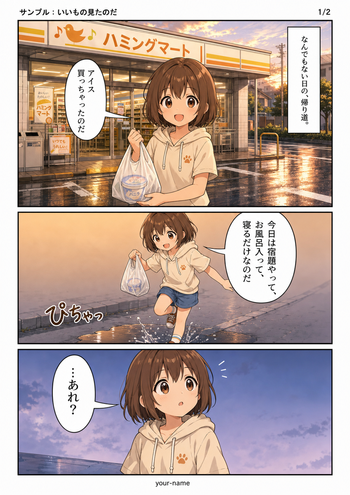
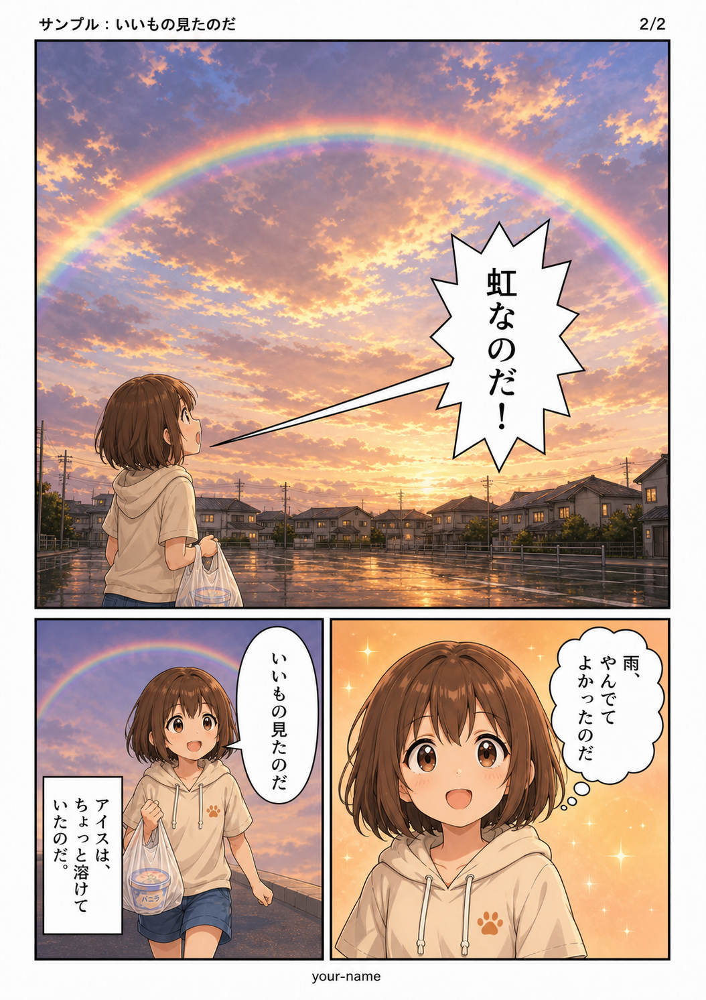

# rimochan-nyamuru-manga-forge 🐹🐱🔨

**用自然语言提出请求，即可产出漫画原稿**——这是一个面向 Claude Code 的技能。

它将分镜设计、作画、回收与质检整合为一条流水线。
只要写下“请画一部 5 页、讲述这样一个故事的漫画”，就能得到
page1.png … page5.png。

~~~
你的一句话
   ↓  Claude Code 设计分镜
OMNY（漫画分镜 YAML，以绝对坐标定义分格）
   ↓  连同 OMAY（作画与版式规则）交给图像生成 AI
完成原稿 page1.png、page2.png、……
~~~

例如，渲染随附的示例分镜
[examples/sample-2page.omny.yaml](examples/sample-2page.omny.yaml)，即可得到以下两页：

  
  

无需参考图。仅凭分镜 YAML 中的分格坐标、气泡形状、背景细节等级和
materials.note 的文本，就能生成这份原稿。
第 1 页末尾的“悬念”由第 2 页开头的大格承接，翻页结构也完全遵循分镜设定。

---

## 它是什么，又不是什么

- ✅ 用**结构化数据编写漫画分镜，并将其渲染为原稿**的流水线
- ✅ 页数、分格、气泡形状、背景细节都能作为**数据**指定
- ✅ 在同一轮对话中连续渲染各页，因此**角色设计和画风能跨页保持一致**
- ❌ 它不是图像生成模型本身（作画交由 codex / ChatGPT 图像生成）
- ❌ 它不是一键产出杰作的魔法；**分镜质量会直接反映在成稿中**

如果希望人工编辑分镜，可以使用姊妹项目
[**Nyamuru Manga Name Studio**](https://github.com/sa-san10/nyamuru-manga-name-studio)
（可在浏览器运行的分镜编辑 PWA）。两者使用相同的 OMNY 格式，
可将 Studio 中整理好的分镜直接交给本 forge。

---

## 所需环境

| 要求 | 说明 |
|---|---|
| [Claude Code](https://claude.com/claude-code) | 作为技能载入 |
| codex CLI | 负责作画；需登录支持图像生成功能的方案 |
| bash | Windows 可使用 Git Bash（本项目也在该环境开发） |
| 参考图（可选） | 角色立绘；没有也可由 AI 根据描述设计 |

安装说明请参阅 [docs/setup.md](docs/setup.md)。

---

## 5 分钟试用

~~~bash
git clone https://github.com/feng082/rimochan-nyamuru-manga-forge
cd rimochan-nyamuru-manga-forge

# 渲染随附的 2 页示例分镜
./scripts/forge.sh -n examples/sample-2page.omny.yaml
~~~

将生成 out/sample-2page/page1.png 和 page2.png。
成品示例就是本页开头展示的两张图（位于
[examples/output-sample/](examples/output-sample/)）。
10 页作品通常需要约 10～20 分钟，因为页面会逐张顺序绘制。

如需用自己的角色作画，请提供角色立绘（建议最多 3 张）：

~~~bash
./scripts/forge.sh -n my.omny.yaml \
  -r chars/hero.png -r chars/rival.png \
  -m "画风为蜡笔画；主角始终佩戴红色围巾"
~~~

完成的原稿可交付到任意位置（建议同时保留分镜，作为可复用资产）：

~~~bash
./scripts/deliver.sh -f out/my -t ~/Desktop/my -n my.omny.yaml
~~~

---

## 作为 Claude Code 技能使用

这才是本项目的主要使用方式：**从编写分镜开始就可以交给它。**

~~~bash
# 面向当前用户全局使用
cp -r . ~/.claude/skills/manga-forge

# 或仅用于某个项目
cp -r . <your-project>/.claude/skills/manga-forge
~~~

之后直接用自然语言请求 Claude Code：

> 请画一部 5 页漫画。主题是“搬家那天，旧书桌抽屉里发现了以前的信”。
> 结尾请安静收束。角色请使用 chars/ 中的立绘。

Claude Code 会依次：
① 编写故事，② 用 OMNY 设计分格，③ 通过 forge.sh 渲染，
④ 查看全部页面并质检，⑤ 交付到你指定的位置。

---

## 仓库内容

~~~
SKILL.md                    Claude Code 技能本体（会被读取）
omay/standard.omay.yaml     作画、演出规则和版式规范（OMAY）
omay/styles.md              画风调色板（12 组提示词）
prompts/ndm-v10.md          分镜生成提示词（OMNY 的完整写法规范）
scripts/forge.sh            将 OMNY 渲染为原稿 PNG 的驱动脚本
scripts/collect.sh          按页码回收生成图像
scripts/deliver.sh          将通过质检的原稿交付到指定位置
examples/                   示例分镜
docs/setup.md               codex CLI 的准备说明
docs/characters.md          注册自己的角色与背景
docs/pitfalls.md            ⚠️ 常见陷阱全集（先读可节省数天时间）
~~~

### 📌 请先阅读 docs/pitfalls.md

让 AI 画漫画时，人们往往会在同一些地方跌倒：
“只做声明却没有生成图像”“resume 混入另一部作品”
“画面没有落在 bbox 指定位置”——**这些问题都已经实际遇到并记录在案。**

---

## 关于 OMNY / OMAY

- **OMNY**（Open Manga Name YAML）：描述漫画分镜的数据格式，包含页面、格子的绝对坐标、气泡形状和位置、人物布局及背景细节。
- **OMAY**（Open Manga Artwork YAML）：规定“如何绘制”这些分镜的规则，是交给作画 AI 的通用指令。

分镜结构化后，不仅可以渲染成原稿，也能继续用于
**让格子动起来、以另一种画风重新印制、在编辑工具中打开**等后续环节。

本仓库以 [prompts/ndm-v10.md](prompts/ndm-v10.md) 和
[omay/standard.omay.yaml](omay/standard.omay.yaml) 为准。
上游规范位于
[Nyamuru Manga Name Studio](https://github.com/sa-san10/nyamuru-manga-name-studio)
（详见下方“与上游仓库的关系”）。

---

## 名称由来

`rimochan` 是 Claude Code 代理**理莫酱**的名字；她每天用这条流水线持续绘制漫画。
`nyamuru`（Nyamuru）是数据模型的名称，吉祥物则是猫妖精**Nyamurutan**。

这里记录的各种陷阱，都是理莫酱亲自踩过的坑。

---

## 许可证

- 代码、文档与 OMAY / OMNY 规范：**MIT License**（[LICENSE](LICENSE)）
- 角色“Nyamurutan”：**CC BY 4.0** — 作者 sa-san10

请自行确认用于作画的图像生成服务之使用条款。

---

## 与上游仓库的关系（Nyamuru Manga Name Studio）

本技能的 OMNY / OMAY / 工作流**上游**是
[**Nyamuru Manga Name Studio**](https://github.com/sa-san10/nyamuru-manga-name-studio)，
即用于在浏览器中编辑 OMNY 的 PWA。规范和提示词在 Studio 的 src/content/ 中维护；
本仓库则将其快照实现为“Claude Code 技能 + bash 流水线”。

### 文件对应表

| 本仓库 | Studio 侧（src/content/） | 内容 |
|---|---|---|
| omay/standard.omay.yaml | standard.omay.yaml | OMAY（作画、演出规则与版式规范） |
| prompts/ndm-v10.md | nyamuru-manga-generation-prompt-v10.md（规范主体为 nyamuru-data-model-v10.md） | 分镜生成提示词，即 OMNY 的写法 |
| SKILL.md + scripts/ | agent-manga-generation-workflow.md | 面向代理的生成工作流 |
| examples/sample-2page.omny.yaml | sample.omny.yaml | 示例分镜（各自内容独立） |

### 本 forge 额外增加的内容

本仓库针对日常高频渲染而强化了 Studio 工作流，新增内容包括：

- **成果物强制区块**（防止只声明不生成；见 docs/pitfalls.md 的陷阱 1）
- 以 **page1 = 新会话、page2 起 = resume** 保证跨页一致性（陷阱 3、4）
- 从日志 UUID **回收图像**（collect.sh；陷阱 7）
- 常见陷阱全集（docs/pitfalls.md）与画风调色板（omay/styles.md）

二者的质检理念略有不同：Studio 的工作流将气泡内文字的校对交给人工后处理；
本技能则要求**代理逐页目视检查**，仅重新生成有问题的页面。

### 如何同步最新规范和工作流

若 Studio 端规范有更新，请按以下步骤同步：

1. 查看 Studio 的 src/content/ 差异（若 OMAY 的 spec_version 或 OMNY 的 schema_version 升级，需特别注意）。
2. 将 standard.omay.yaml 覆盖复制到 omay/standard.omay.yaml。
3. 将生成提示词差异合并至 prompts/ndm-v10.md（§D 等 **forge 专有补充不能删除，因此不要整文件覆盖，要做差异合并**）。
4. 确认 spec_version 与 schema_version 一致（背景、边距等数字在提示词和 OMAY 中均刻意重复出现，**两处必须同步修改**）。
5. 重新渲染示例并质检：
   `./scripts/forge.sh -n examples/sample-2page.omny.yaml`

两个仓库均由同一作者 sa-san10 以 MIT 许可证发布，因此可以直接复制规范文件，
无需额外手续（角色“Nyamurutan”除外，其采用 CC BY 4.0）。

在 Studio 中手工打磨的分镜使用相同 OMNY 格式，能够直接交给本 forge。
